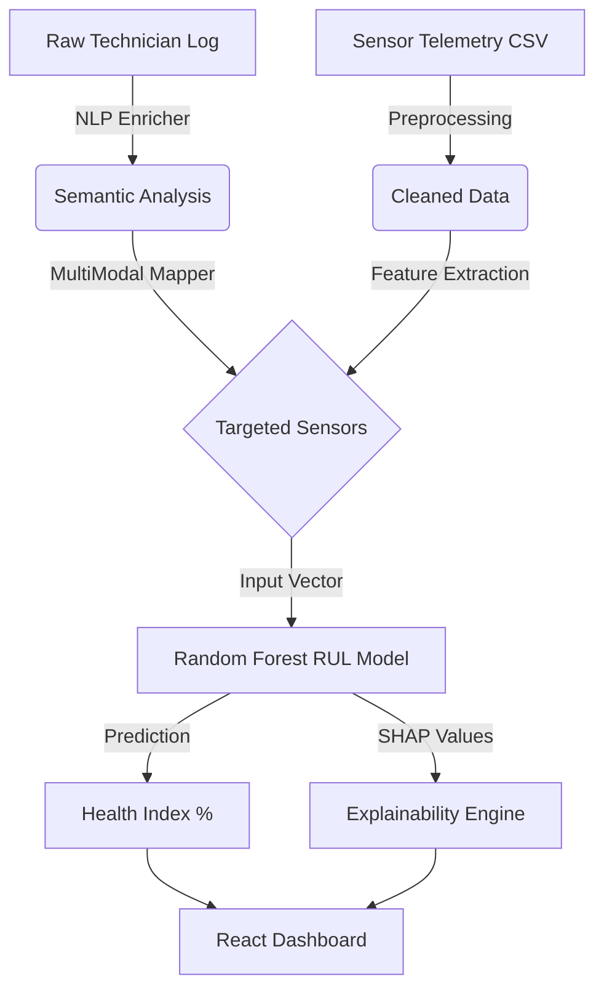

# 🚢 Naval Propulsion AI: Multimodal Predictive Maintenance Pipeline

[](https://www.python.org/)
[](https://scikit-learn.org/)
[](https://shap.readthedocs.io/)
[](https://reactjs.org/)
[](LICENSE)

> **A production-grade, multimodal AI pipeline that fuses unstructured NLP maintenance logs with structured sensor telemetry to predict Remaining Useful Life (RUL) with SHAP-based explainability.**

## 📋 Table of Contents
- [The Problem](#the-problem)
- [The Solution](#the-solution)
- [Architecture](#architecture)
- [Key Features](#key-features)
- [Tech Stack](#tech-stack)
- [Installation & Setup](#installation--setup)
- [Usage](#usage)
- [Results & Explainability](#results--explainability)
- [Future Roadmap: Space Tech Pivot](#future-roadmap-space-tech-pivot)

---

## 🌊 The Problem
Naval propulsion systems generate massive amounts of fragmented data:
1. **Structured Telemetry**: High-frequency sensor readings (Temperatures, Pressures, RPMs).
2. **Unstructured Logs**: Human-written technician reports (e.g., *"Noticed slight vibration on port side"*).

Traditional maintenance relies on reactive fixes or simple threshold alarms, leading to costly downtime. Furthermore, "black-box" AI models are often rejected in safety-critical industries because engineers cannot trust *why* a prediction was made.

## 💡 The Solution
I engineered a **Multimodal Diagnostic Pipeline** that bridges the gap between human intuition and machine precision. 
- It uses **NLP** to extract spatial context and symptoms from technician logs.
- It maps these insights to specific physical sensors.
- It feeds this targeted data into a **Random Forest Regressor** to predict Remaining Useful Life (RUL).
- It uses **SHAP (SHapley Additive exPlanations)** to provide transparent, physics-based reasoning for every prediction.

## 🏗️ Architecture



## ✨ Key Features
- **Multimodal Data Fusion**: Seamlessly integrates text-based maintenance logs with numerical sensor data.
- **Explainable AI (XAI)**: Uses SHAP values to show exactly which sensors (e.g., `GT_Turbine_Temp`) are driving health degradation.
- **Spatial Context Awareness**: The NLP mapper understands "Port" vs. "Starboard" and maps faults to the correct physical assets.
- **Domain-Agnostic Design**: Built with modular `configs/` to allow easy pivoting from Naval to Satellite or Industrial applications.
- **High Accuracy**: Achieved an **R² Score of 0.996** on the validation set, significantly outperforming naive linear heuristics.

## 🛠️ Tech Stack
- **Core Logic**: Python, Pandas, NumPy
- **Machine Learning**: Scikit-Learn (Random Forest), SHAP (Explainability)
- **NLP**: Custom Semantic Enricher, Regex-based Spatial Mapping
- **Visualization**: React.js, Tailwind CSS (Dashboard)
- **Tools**: Git, LTSpice (for hardware co-simulation research)

## 🚀 Installation & Setup

1. **Clone the repository:**
   ```bash
   git clone https://github.com/DoctorDisco23/Predictive_Maintenance_Model.git
   cd Predictive_Maintenance_Model
   ```

2. **Install dependencies:**
   ```bash
   pip install -r requirements.txt
   ```

3. **Ensure you have the dataset:**
   Place `navalplantmaintenance.csv` in the root directory.

## 💻 Usage

### 1. Run the Core AI Pipeline
This will train the model and run a diagnostic on the latest telemetry data.
```bash
python naval_brain.py
```

### 2. Run the Multimodal Integration
This simulates a technician log and runs it through the full NLP-to-AI pipeline.
```bash
python main_pipeline.py
```

### 3. Run Unit Tests
Validate the NLP mapper and spatial context logic.
```bash
python MultiModalMapper.py
```

## 📊 Results & Explainability

The model doesn't just give a number; it gives a **diagnostic report**.

**Sample Output:**
```text
🚢 NAVAL PROPULSION AI (XAI ENABLED)
==================================================
PREDICTED COMPRESSOR HEALTH: 99.96%
--------------------------------------------------
🔍 SHAP EXPLAINABILITY (Why did the AI predict this?):
  • Exh_Press      : +0.02216 impact (⬆️ Stabilizing Health)
  • T_Exit_Press   : +0.00861 impact (⬆️ Stabilizing Health)
  • C_Out_Temp     : -0.00370 impact (⬇️ Degrading Health)
==================================================
```

## 🛰️ Future Roadmap: Space Tech Pivot
This architecture is designed to be **domain-agnostic**. The next phase involves:
1. **Satellite Thermal Subsystems**: Mapping `GT_Turbine_Temp` to `Solar_Array_Temp` and `Compressor_Health` to `Battery_Degradation_Index`.
2. **LTSpice Co-Simulation**: Integrating hardware-level thermal simulations to validate AI predictions against physical constraints.
3. **Edge Deployment**: Optimizing the Random Forest model for deployment on edge devices (e.g., Raspberry Pi or Satellite On-Board Computers).

---

**Author**: Shubh Garg  
**Contact**: [gargshubh2373@gmail.com](mailto:gargshubh2373@gmail.com) | [LinkedIn](https://www.linkedin.com/in/shubh-garg/)
